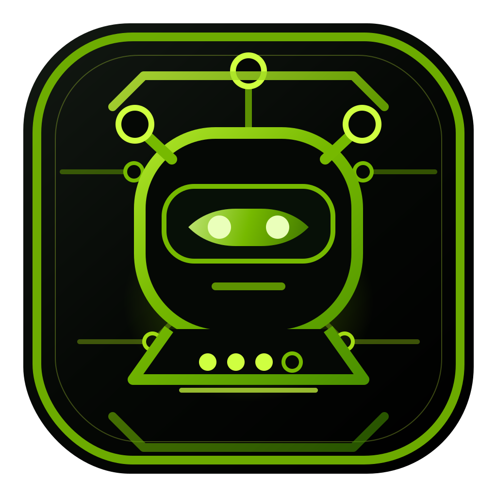

# agent-me

<p align="center">
  
</p>

[](https://github.com/thanhpt1110/agent-me/actions/workflows/ci.yml)
[](https://github.com/thanhpt1110/agent-me/actions/workflows/codeql.yml)
[](LICENSE)
[](pyproject.toml)
[](https://www.nvidia.com)
[](https://hits.sh/github.com/thanhpt1110/agent-me/)
[](https://github.com/thanhpt1110/agent-me/stargazers)

> _myself, but in agent mode._

Personal AI OS — a public-shareable framework for a 24/7 always-on autonomous agent that handles your daily/weekly workload. Fork it, set your own configs, deploy your own `agent-me`. **Built at [NVIDIA](https://www.nvidia.com)** by [@thanhpt1110](https://github.com/thanhpt1110); first operator runs on the NVIDIA Colossus internal network.

## Quickstart for forkers

Prerequisites: `codex` CLI, [uv](https://docs.astral.sh/uv/), `gh` CLI, `jq`, Python 3.12+, Node (for the Playwright MCP).

1. **Use this template** on GitHub → create your own copy.
2. **Clone & bootstrap**:
   ```bash
   git clone git@github.com:<you>/agent-me.git
   cd agent-me
   ./scripts/bootstrap.sh
   ```
   Runs `uv sync`, prepares `configs/.env`, and registers all 17 MaaS MCP servers with Codex idempotently (Jira, GitLab, Confluence, NVBugs, Slack, Outlook, GDrive, OneDrive, SharePoint, Glean, Jama, IPPSEC, MySQL, Nsight-CUDA, NVKS-Prometheus, PagerDuty, Playwright). See `design/setup-on-fresh-host.md` for the long version (incl. cloud-host specifics).
3. **Three interactive steps** the bootstrap script reminds you to do (browser required):
   - `codex login` — one-time per machine.
   - `uv run agent-me-codex-reauth` — refreshes the MaaS OAuth token store used by Codex bearer-token MCPs and opens/prints NVIDIA-SSO URLs where needed.
   - If the bridge runs on Colossus but your browser is on a Mac, run this on the Mac instead: `./scripts/mac-reauth-and-sync.sh <ssh-host>`. It opens all auth tabs locally, syncs refreshed credentials back to the host, and prepares Codex MCP token env vars for future host sessions.
   - Fill `configs/.env` with Slack tokens (template = `configs/.env.example`). Slack app walkthrough: `design/slack-app-setup.md`.
   - Daily host auth shortcuts from the Mac:
     ```bash
     # Reauth on the Mac, then push credentials and Codex env exports to this host.
     ./scripts/mac-reauth-and-sync.sh 1xA100-40

     # Copy current Mac Keychain credentials to this host only.
     ./scripts/sync-mcp-creds-to-host.sh 1xA100-40

     # Reauth only on the current machine; no host sync.
     uv run agent-me-codex-reauth
     ```
     New shell-launched Codex sessions on the host inherit the refreshed MCP env automatically. The running Slack bridge can force-refresh host-side MaaS OAuth tokens and reload the env without restart: type `mcp refresh` or `/mcp refresh` in Slack. Run the Mac sync only when that command reports a rejected refresh token or a tool still returns 401.
4. **Verify**:
   ```bash
   codex mcp list                             # all 17 MaaS MCPs should be registered
   uv run agent-me-brief --period day --dry-run
   ```
5. **Run the bridge**:
   ```bash
   uv run agent-me-bridge
   ```
   From Slack, DM the bot or use `/help`, `/mcp`, `/reauth`, `/version`, `/whoami`, `/brief`, or the **Auto SFA** help button.
   Briefs invoked from a thread post each platform as a separate message in that thread and mirror a concise digest to `thaphan@nvidia.com` through the Codex Slack connector, not the personal-workspace bot token. Reads use `codex exec`; permissioned connector/MCP writes use Codex app-server auto-review.
   Auto SFA exposes two workflows from Slack, the dashboard, and the native MCP endpoint mounted at `/mcp/`. `Create SFA Tasks` prepares templates with `magic-auto update-template` from `display_name` + `folder_id`, defaults `Win_Linux` to `Linux Only`, and supports `Windows Only` / `Both` overrides. `Release SFA Tasks` runs the existing `magic-auto sfa` release path from `display_name` + `url_path`, defaults to `Linux Release` source `50722`, end date = today in Vietnam, start date = seven days earlier, complexity `L2`, and auto-resolves the destination folder; `Release` type switches to source `47877`. The dashboard asks for per-run DevTest `USERNAME`/`PASSWORD`; MCP users visit `/mcp/setup` once, verify DevTest credentials, and receive a long-lived Agent Me bearer token plus Cursor/Codex/Claude install snippets. MCP tools never call another agent or LLM; they return `needs_input` for incomplete requests and `needs_confirmation` with a `confirmation_token` before side effects. Passwords are encrypted server-side for MCP token use and are not written to server config, job history, or public MCP responses. Dashboard, Slack, and MCP triggers are recorded in `auto_sfa_runs` for the dashboard's scrollable trigger history.
6. **(Optional) Native slash commands**: register `/mcp`, `/reauth`, `/version`, `/whoami`, `/help`, `/brief`, `/model-free-draft` in the Slack app config — see `design/slack-app-setup.md` §12b. Without this, prefix the command with `@agent-me ` (the bridge intercepts text-form slashes too).
7. **(Optional) Deploy on a 24/7 host**: `design/deploy-on-host.md` is the end-to-end playbook (Colossus / any internal-NVIDIA systemd Linux box). Auto-deploys on every git push (60s polling watcher → systemctl restart bridge + dashboard).
8. **(Optional) Web dashboard at [`https://agent-me.nvidia.com`](https://agent-me.nvidia.com)**: Phase 4 dashboard, **NVIDIA-themed (black + `#76b900` brand green)**, reads bridge state, surfaces pending tasks across 9 platform groups, runs on-demand brief refreshes, and streams live logs.
   - **Overview**: stats row (Threads 24h · Codex sessions · Pending approvals · **Pending across all platforms**), then an expandable card per platform group (Jira / GitLab / Confluence / NVBugs / Slack / Outlook / Outlook Calendar / GitHub + Slack threads + Codex sessions). Each card shows pending count, expand to see deep-linked subtasks with priority / due / age. Pending items are **mock data** today (clearly labelled "mock — Phase 5 real data"); design at `design/dashboard-pending-panel.md`.
   - **Briefs by source**: 7 source cards, click-through to drill in or trigger a single-source brief refresh; SSE-streamed progress badges; "Refresh all" fan-out. The dashboard `Refresh all` and `Refresh MCP auth` actions require the operator passcode before the backend accepts the request.
   - **Ops**: bridge stats, MCP health probe (`codex mcp list` parsed), recent brief runs, recent Slack threads, live `bridge.log` + `brief.log` tail.
   - **Logs**: 3-tab live SSE viewer — watcher journal / filtered Slack-interaction events / per-session Codex trace.
   - **Auto SFA**: form-based runner for the same `magic-auto` flow, with live SSE terminal output. The Auto SFA header includes an `MCP Setup` link to `/mcp/setup` for one-time token setup and same-browser token reuse.
   - **Two-host setup**:
     - **Backend** runs alongside the bridge on the same host as step 7 — `./scripts/install-dashboard.sh` from the repo root. See `design/deploy-on-host.md` § Step 9.
     - **Reverse proxy** (`https://agent-me.nvidia.com`, NVIDIA-VPN-gated) — handed to whoever operates the proxy server. Self-contained playbook in `design/deploy-proxy-on-host.md`; nginx/caddy/traefik snippets in `design/reverse-proxy-config.md`.

## Architecture overview

```
┌───────────────────────────────────────────────────────────┐
│  Interface Layer (how user chats or issues remote commands)│
│  - Slack/Teams bot? Telegram? Email? Web UI? CLI SSH?     │
└───────────────────────────────┬───────────────────────────┘
                                │
┌───────────────────────────────▼───────────────────────────┐
│  Orchestrator (Codex)                                     │
│  - Reads/chat → headless `codex exec --json`              │
│  - Connector/MCP writes → app-server auto-review          │
│  - Route request → correct sub-agent                      │
│  - Schedule daily/weekly cron jobs                        │
│  - Memory & state (file-based, sync GitHub)               │
└──┬──────────┬──────────┬──────────┬──────────┬────────────┘
   │          │          │          │          │
┌──▼──┐    ┌──▼──┐    ┌──▼──┐    ┌──▼──┐    ┌──▼──┐
│Work │    │Know-│    │Code │    │Ops  │    │Life │
│Jira │    │ledge│    │Git- │    │Cloud host │    │Cal  │
│Bugs │    │Glean│    │Lab  │    │mon  │    │Mail │
└─────┘    └─────┘    └─────┘    └─────┘    └─────┘

┌───────────────────────────────────────────────────────────┐
│  Persistence: GitHub repo (private)                       │
│  - /configs, /skills, /prompts, /agents, /briefs (output) │
│  - Pull on startup, push on change                        │
└───────────────────────────────────────────────────────────┘

┌───────────────────────────────────────────────────────────┐
│  Runtime host (24/7):                                     │
│  Option A — user's existing online server (SSH access)    │
│  Option B — cloud host instance (GPU not needed, CPU OK)  │
│  Option C — launchd local Mac (offline when machine is off)│
└───────────────────────────────────────────────────────────┘
```

## Layout

- `discussions/` — chat logs & decision records (one per session, dated)
- `design/` — architecture docs, diagrams, ADRs
- `configs/` — runtime configs (synced to GitHub)
- `skills/` — custom skills the agent can invoke
- `scripts/` — bootstrap, deploy, sync scripts
- `assets/` — project avatar/logo SVG and PNG workspace icons

## Status

This framework is under active development. See [STATE.md](STATE.md) for the current development phase, what's in flight, and what's next.

## License

MIT — see [LICENSE](LICENSE). Fork freely, deploy your own, and tell us what you build.

---

<sub>
  <a href="https://www.nvidia.com"></a>
  &nbsp;Built at <a href="https://www.nvidia.com">NVIDIA</a> · maintained by
  <a href="https://github.com/thanhpt1110">@thanhpt1110</a> · code of conduct via
  <a href="CODE_OF_CONDUCT.md">Contributor Covenant 2.1</a> · security disclosures
  in <a href="SECURITY.md">SECURITY.md</a>.
</sub>
