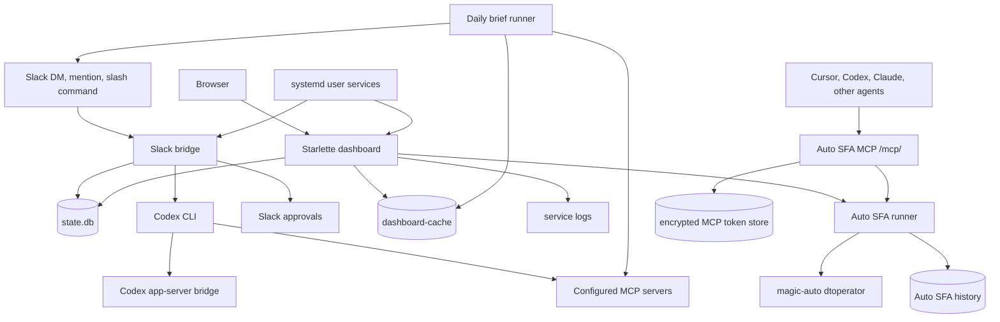

# agent-me

<p align="center">
  
</p>

[](https://github.com/thanhpt1110/agent-me/actions/workflows/ci.yml)
[](https://github.com/thanhpt1110/agent-me/actions/workflows/codeql.yml)
[](LICENSE)
[](pyproject.toml)
[](https://www.nvidia.com)
[](https://hits.sh/github.com/thanhpt1110/agent-me/)
[](https://github.com/thanhpt1110/agent-me/stargazers)

> _myself, but in agent mode._

`agent-me` is a 24/7 personal-agent runtime for Slack, a web dashboard, daily
engineering briefs, and Auto SFA automation. It keeps conversation state in
SQLite, runs Codex with the right MCP environment, gates side effects through
human approval when needed, and exposes Auto SFA as a native MCP endpoint for
other agent clients.

Built at NVIDIA by [thaphan@nvidia.com](mailto:thaphan@nvidia.com).

## What Runs Today

- **Slack bridge** - Slack Socket Mode app with thread memory, slash/plain-text
  commands, approval buttons, daily brief triggers, and Auto SFA shortcuts.
- **Codex orchestration** - General Slack requests run through the Codex CLI
  (`codex exec --json`) with persisted context, MCP credentials, summaries, and
  permissioned write handling.
- **Daily briefs** - Jira, GitHub, GitLab, Slack, Teams, Outlook, Calendar,
  NVBugs, and MaaS signals are normalized into Slack threads and dashboard
  cache files.
- **Dashboard** - Starlette web UI for source health, brief output, logs,
  operator actions, Auto SFA history, and MCP setup.
- **Auto SFA UI** - Guided create/release workflows stream terminal output,
  support cancellation, and persist run history.
- **Auto SFA MCP** - Streamable HTTP MCP endpoint exposing `create_sfa_tasks`
  and `release_sfa_tasks` to Cursor, Codex, Claude, and other MCP clients.
- **MCP credential helpers** - Claude/Codex MCP OAuth refresh utilities export
  short-lived environment files before Codex runs.
- **Parallel queue** - File-backed queue for coordinating helper-agent work
  while retaining source-thread metadata.

## Architecture



The runtime is split into four layers:

- **Interfaces** - Slack, dashboard pages/APIs/SSE streams, and the `/mcp/`
  Streamable HTTP MCP endpoint.
- **Orchestration** - Codex subprocess runs, Codex app-server writes, daily
  brief fan-out, Auto SFA job execution, and the optional parallel queue.
- **State** - `state.db` for Slack threads, messages, approvals, and Auto SFA
  history; `dashboard-cache` for brief output; encrypted Auto SFA MCP token
  storage for reusable DevTest-backed MCP access.
- **Ops** - systemd user units, bootstrap/deploy scripts, auth refresh scripts,
  log watchers, health probes, and docs under `design/` and `discussions/`.

## Key Workflows

### Slack Chat

The Slack bridge in `src/agent_me/slack_bridge/app.py` receives DMs, app
mentions, and slash commands. It stores thread/message context in `state.db`,
builds a Codex prompt with the relevant conversation history, refreshes MCP
credentials, and launches `codex exec --json`. The final response is written
back to the Slack thread.

Supported Slack shortcuts include:

| Command | Behavior |
| --- | --- |
| `brief`, `brief week`, `brief month` | Run a daily, weekly, or monthly brief |
| `mcp`, `mcp refresh`, `reauth` | Show or refresh MCP auth state |
| `whoami` | Show the configured Slack identity |
| `auto sfa`, `create sfa tasks` | Start guided Auto SFA flows |
| `model-free-draft` | Draft without launching a model |
| anything else | Send the request to Codex with thread context |

### Permissioned Writes

When Codex needs to call connector/app-server write tools, the bridge uses
`src/agent_me/codex_app_server.py` and the Slack approval plumbing in
`src/agent_me/slack_bridge/approvals.py`. Pending requests are persisted, Slack
buttons collect the approval decision, and Codex receives the result through the
approval hook.

### Daily Briefs

`src/agent_me/scripts/daily_brief.py` gathers work signals from the configured
sources, normalizes them into brief items, posts Slack summary threads, and
writes dashboard cache files. Direct MaaS JSON-RPC calls are used where useful;
Slack, Teams, Outlook, Calendar, Jira, GitHub, GitLab, and NVBugs use the
available connector or CLI paths.

### Dashboard

`src/agent_me/dashboard/app.py` serves the web UI and APIs. It reads `state.db`
and `dashboard-cache` through `state_reader.py`, streams logs and Auto SFA job
events over SSE, exposes health and MCP-auth actions, and mounts the Auto SFA
MCP app at `/mcp/`.

Important pages:

| Path | Purpose |
| --- | --- |
| `/` | Brief dashboard and source cards |
| `/ops` | Operations, logs, and health checks |
| `/auto-sfa` | Auto SFA UI, terminal stream, and history |
| `/mcp/setup` | Generate/reuse an Agent Me MCP token and client configs |
| `/healthz` | Health probe |

### Auto SFA

Auto SFA logic is centralized in `src/agent_me/auto_sfa.py`. It parses keyed or
natural-language requests, validates required fields, writes temporary
`magic-auto` config files with per-run DevTest credentials, redacts sensitive
values in displayed commands, and runs `dtoperator.py` through `uv`.

Two flows are supported:

| Flow | Backend action | Main inputs |
| --- | --- | --- |
| Create SFA tasks | `dtoperator.py update-template` | display name, folder ID, Win/Linux option |
| Release SFA tasks | `dtoperator.py sfa` | template IDs, source type, date window, finish date, complexity, optional destination folder |

The dashboard runner in `src/agent_me/dashboard/auto_sfa_runner.py` manages
in-memory jobs, cancellation, live terminal streaming, and persisted history.

### Auto SFA MCP

`src/agent_me/auto_sfa_mcp.py` exposes Auto SFA as a Streamable HTTP MCP server:

```text
http://agent-me.nvidia.com/mcp/
```

The public tools are:

| Tool | Purpose |
| --- | --- |
| `create_sfa_tasks` | Create Auto SFA template tasks for a display name and folder ID |
| `release_sfa_tasks` | Release or auto templates using Linux Release or Release defaults |

Complete tool calls start jobs immediately and return `job_id`, `job_url`, and
the Auto SFA dashboard URL. Incomplete calls return structured `needs_input`
responses so the MCP client can ask for missing fields before execution. The MCP
server does not call another LLM to interpret requests; the client chooses the
tool and sends structured arguments.

Authentication uses bearer tokens generated on `/mcp/setup`. Tokens are stored
server-side as encrypted records in `src/agent_me/auto_sfa_mcp_store.py`; the
browser cookie only stores a signed token digest. Tokens do not expire by
default unless `AUTO_SFA_MCP_TOKEN_TTL_DAYS` is configured.

### Auth And State

- `src/agent_me/mcp_tokens.py` reads Claude MCP OAuth credentials, refreshes
  MaaS tokens, exports `AGENT_ME_MCP_TOKEN_*` environment variables, and writes
  `~/.config/agent-me/codex-mcp-env.sh` for Codex subprocesses.
- `agent-me-reauth` and `agent-me-codex-reauth` refresh Claude and Codex MCP
  credential paths.
- `state.db` stores Slack thread metadata, message history, pending approvals,
  Auto SFA flow state, and Auto SFA run history.
- `auto-sfa-mcp.db` and `auto-sfa-mcp.fernet` store reusable MCP tokens and
  encrypted DevTest credentials.

## Quickstart

Prerequisites:

- Linux host with Python 3.12+
- `uv`
- Slack app credentials
- Codex CLI
- Claude/Codex MCP auth configured for the internal MCP servers
- Access to `magic-auto` for Auto SFA workflows

Install:

```bash
git clone git@github.com:thanhpt1110/agent-me.git
cd agent-me
uv sync --dev
cp configs/.env.example configs/.env
```

Fill `configs/.env` with your Slack, Codex, dashboard, state, and MCP paths. At
minimum:

```dotenv
SLACK_BOT_TOKEN=xoxb-...
SLACK_APP_TOKEN=xapp-...
SLACK_SIGNING_SECRET=...
SLACK_DEFAULT_CHANNEL_ID=C...
SLACK_DEFAULT_USER_ID=U...
CODEX_HOME=/localhome/<user>/.codex
AGENT_ME_STATE_DIR=/localhome/<user>/.local/share/agent-me
AGENT_ME_APPROVALS_PATH=/localhome/<user>/.local/share/agent-me/approvals.jsonl
AGENT_ME_BRIEF_CHANNEL_ID=C...
```

Authenticate MCP providers and verify the install:

```bash
uv run agent-me-reauth
uv run agent-me-codex-reauth
uv run pytest
```

Run locally:

```bash
uv run agent-me-bridge
uv run agent-me-dashboard --host 127.0.0.1 --port 8778
```

## Deploy

Deployment helpers live in `scripts/` and systemd user units live in `deploy/`.
The current internal deployment is served through `agent-me.nvidia.com`.

```bash
./scripts/bootstrap.sh
./scripts/install-systemd.sh
./scripts/install-dashboard.sh
systemctl --user status agent-me-bridge.service
systemctl --user status agent-me-dashboard.service
```

Core user services:

| Unit | Purpose |
| --- | --- |
| `agent-me-bridge.service` | Slack/Codex bridge |
| `agent-me-dashboard.service` | Starlette dashboard and MCP endpoint |
| `agent-me-watch.service` | Git polling deploy watcher |
| `agent-me-funnel.service` | Optional Tailscale Funnel process |

See [`design/deploy-on-host.md`](design/deploy-on-host.md),
[`design/deploy-proxy-on-host.md`](design/deploy-proxy-on-host.md), and
[`STATE.md`](STATE.md) for current operations notes.

## Source Map

| Path | Responsibility |
| --- | --- |
| `src/agent_me/slack_bridge/app.py` | Slack Socket Mode bridge, commands, Codex runs, Auto SFA Slack flows |
| `src/agent_me/slack_bridge/approvals.py` | Slack approval lifecycle for permissioned tool calls |
| `src/agent_me/codex_app_server.py` | Codex app-server helper for connector writes |
| `src/agent_me/mcp_tokens.py` | MCP OAuth/token refresh and Codex env export |
| `src/agent_me/scripts/daily_brief.py` | Multi-source brief fan-out, Slack posting, dashboard cache writer |
| `src/agent_me/dashboard/app.py` | Starlette routes, APIs, SSE, login, MCP setup, Auto SFA pages |
| `src/agent_me/dashboard/state_reader.py` | Read-only dashboard state, cache, logs, and MCP status |
| `src/agent_me/dashboard/brief_runner.py` | On-demand dashboard brief refresh jobs |
| `src/agent_me/dashboard/auto_sfa_runner.py` | Auto SFA job lifecycle, SSE events, cancellation, persisted history |
| `src/agent_me/auto_sfa.py` | Shared Auto SFA parsing, validation, config generation, command execution |
| `src/agent_me/auto_sfa_mcp.py` | Streamable HTTP MCP server for Auto SFA tools |
| `src/agent_me/auto_sfa_mcp_store.py` | Encrypted MCP token and DevTest credential store |
| `src/agent_me/auto_sfa_history.py` | Persisted Auto SFA run history |
| `src/agent_me/parallel_queue.py` | File-backed helper-agent queue |
| `configs/` | Example environment and runtime configuration |
| `deploy/` | systemd user units |
| `design/` | Architecture, deployment, and planning docs |
| `discussions/` | Dated decisions and implementation notes |
| `scripts/` | Bootstrap, deploy, auth, sync, and log helpers |
| `tests/` | Unit and integration tests |

## Command Reference

Project scripts from `pyproject.toml`:

| Command | Purpose |
| --- | --- |
| `uv run agent-me-bridge` | Run the Slack bridge |
| `uv run agent-me-dashboard` | Run the dashboard and MCP endpoint |
| `uv run agent-me-brief` | Run the daily brief job |
| `uv run agent-me-reauth` | Refresh Claude MCP credentials |
| `uv run agent-me-codex-reauth` | Refresh Codex MCP credentials |
| `uv run agent-me-parallel-queue` | Run queue helper commands |

Useful diagnostics:

```bash
systemctl --user status agent-me-bridge.service
systemctl --user status agent-me-dashboard.service
journalctl --user -u agent-me-dashboard.service -f
./scripts/tail-log.sh
```

## Testing

```bash
uv run ruff check .
uv run pytest
uv run pyright
```

For README-only changes, `git diff --check` is usually enough to catch
formatting and whitespace issues before committing.

## Project Status

The canonical state tracker is [`STATE.md`](STATE.md). It records shipped
milestones, current service status, and pending follow-ups. Detailed decisions
and discussion history are kept under [`discussions/`](discussions/).

## License

MIT — see [LICENSE](LICENSE). Fork freely, deploy your own, and tell us what you build.

---

<sub>
  <a href="https://www.nvidia.com"></a>
  &nbsp;Built at <a href="https://www.nvidia.com">NVIDIA</a> · maintained by
  <a href="https://github.com/thanhpt1110">@thanhpt1110</a> · code of conduct via
  <a href="CODE_OF_CONDUCT.md">Contributor Covenant 2.1</a> · security disclosures
  in <a href="SECURITY.md">SECURITY.md</a>.
</sub>
