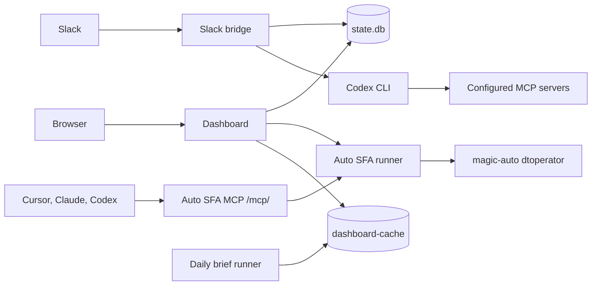

# agent-me

<p align="center">
  
</p>

[](https://github.com/thanhpt1110/agent-me/actions/workflows/ci.yml)
[](https://github.com/thanhpt1110/agent-me/actions/workflows/codeql.yml)
[](LICENSE)
[](pyproject.toml)
[](https://www.nvidia.com)
[](https://hits.sh/github.com/thanhpt1110/agent-me/)
[](https://github.com/thanhpt1110/agent-me/stargazers)

> _myself, but in agent mode._

`agent-me` is a 24/7 personal-agent runtime for Slack, a web dashboard, daily
engineering briefs, and Auto SFA automation. It keeps conversation state in
SQLite, runs Codex with the right MCP environment, gates side effects through
human approval when needed, and exposes Auto SFA as a native MCP endpoint for
other agent clients.

Built for NVIDIA VRDC SWQA.

Author: [Thanh Phan](mailto:thaphan@nvidia.com)
Co-author: OpenAI Codex

## What It Does

- Slack bot for chat, commands, approvals, MCP auth checks, and daily briefs.
- Web dashboard for source status, logs, brief output, operations, Auto SFA, and
  MCP setup.
- Auto SFA UI for create/release flows with live terminal output and run
  history.
- Auto SFA MCP server so Cursor, Codex, Claude, and other agent clients can call
  the same automation through tools.
- Daily brief runner that collects engineering signals from Jira, GitHub,
  GitLab, Slack, Teams, Outlook, Calendar, NVBugs, and MaaS-backed sources.

## Architecture



Interfaces live in Slack, the dashboard, and `/mcp/`; state lives in SQLite,
dashboard cache files, and the encrypted MCP token store.

## Stack

| Area | Stack |
| --- | --- |
| Runtime | Python 3.12, `uv` |
| Web | Starlette, Uvicorn, Jinja2, SSE |
| Slack | Slack Bolt, Socket Mode |
| Agent runtime | Codex CLI, Codex app-server, MCP |
| Storage | SQLite, JSON cache files, encrypted Fernet token store |
| Auto SFA | `magic-auto` / `dtoperator.py` |
| Ops | systemd user services, shell deploy/auth helpers |

## Services

| Service | Command | Purpose |
| --- | --- |
| Slack bridge | `uv run agent-me-bridge` | Slack chat, commands, Codex execution, approvals |
| Dashboard | `uv run agent-me-dashboard` | Web UI, APIs, logs, Auto SFA UI, MCP endpoint |
| Daily brief | `uv run agent-me-brief` | Multi-source daily/weekly/monthly summaries |
| MCP auth refresh | `uv run agent-me-reauth` / `uv run agent-me-codex-reauth` | Refresh Claude/Codex MCP credentials |
| Parallel queue | `uv run agent-me-parallel-queue` | File-backed helper-agent queue |

## Main Workflows

| Workflow | Description |
| --- | --- |
| Slack agent | DMs, mentions, and slash/plain-text commands run through Codex with thread memory. Permissioned writes are confirmed through Slack approvals. |
| Daily brief | `brief`, `brief week`, and `brief month` collect work signals and post summaries to Slack and the dashboard cache. |
| Dashboard | `/` shows brief/source status, `/ops` shows service health/logs, `/auto-sfa` runs Auto SFA jobs, and `/mcp/setup` creates reusable MCP tokens. |
| Auto SFA UI | Creates SFA tasks and releases templates through `magic-auto`, using per-run DevTest credentials and live SSE terminal output. |
| Auto SFA MCP | `http://agent-me.nvidia.com/mcp/` exposes `create_sfa_tasks` and `release_sfa_tasks`. Users set up once at `/mcp/setup`, then connect agent clients with a bearer token. |
| MCP auth refresh | Refresh scripts keep Claude/Codex MCP credentials usable for Codex subprocesses and bridge operations. |

## Quickstart

Prerequisites: Linux, Python 3.12+, `uv`, Slack app credentials, Codex CLI,
Claude/Codex MCP auth, and access to `magic-auto` for Auto SFA workflows.

Install:

```bash
git clone git@github.com:thanhpt1110/agent-me.git
cd agent-me
uv sync --dev
cp configs/.env.example configs/.env
```

Fill `configs/.env` from `configs/.env.example` with Slack tokens, Codex paths,
state paths, dashboard settings, and MCP/auth settings for the host.

Authenticate MCP providers and verify the install:

```bash
uv run agent-me-reauth
uv run agent-me-codex-reauth
uv run pytest
```

Run locally:

```bash
uv run agent-me-bridge
uv run agent-me-dashboard --host 127.0.0.1 --port 8778
```

## Deploy

Deployment helpers live in `scripts/` and systemd user units live in `deploy/`.
The current internal deployment is served through `agent-me.nvidia.com`.

```bash
./scripts/bootstrap.sh
./scripts/install-systemd.sh
./scripts/install-dashboard.sh
systemctl --user status agent-me-bridge.service
systemctl --user status agent-me-dashboard.service
```

Core user services: `agent-me-bridge.service`, `agent-me-dashboard.service`,
`agent-me-watch.service`, and optional `agent-me-funnel.service`.

See [`design/deploy-on-host.md`](design/deploy-on-host.md),
[`design/deploy-proxy-on-host.md`](design/deploy-proxy-on-host.md), and
[`STATE.md`](STATE.md) for current operations notes.

## Repo Layout

```text
src/agent_me/    Python package for Slack, dashboard, MCP, briefs, Auto SFA
configs/         Runtime configuration templates
deploy/          systemd user service files
design/          Architecture and deployment notes
discussions/     Decision records and implementation notes
scripts/         Bootstrap, deploy, auth, sync, and log helpers
tests/           Unit and integration tests
```

Useful diagnostics: `systemctl --user status ...`, `journalctl --user -u ...`,
and `./scripts/tail-log.sh`.

## Testing

```bash
uv run ruff check .
uv run pytest
uv run pyright
```

## Project Status

See [`STATE.md`](STATE.md) for shipped milestones, service status, and pending
follow-ups. Decision notes live under [`discussions/`](discussions/).

## License

MIT — see [LICENSE](LICENSE). Fork freely, deploy your own, and tell us what you build.

---

<sub>
  <a href="https://www.nvidia.com"></a>
  &nbsp;Built at <a href="https://www.nvidia.com">NVIDIA</a> · maintained by
  <a href="https://github.com/thanhpt1110">@thanhpt1110</a> · code of conduct via
  <a href="CODE_OF_CONDUCT.md">Contributor Covenant 2.1</a> · security disclosures
  in <a href="SECURITY.md">SECURITY.md</a>.
</sub>
